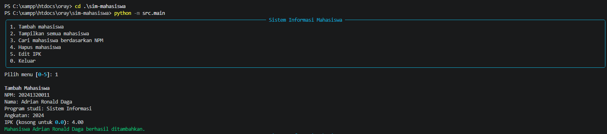
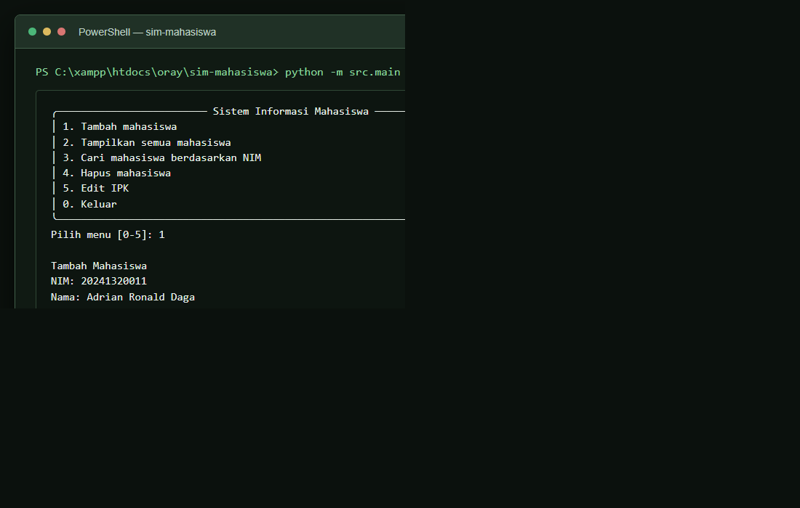

# Sistem Informasi Mahasiswa (SIM)

Aplikasi console berbasis Python untuk mengelola data mahasiswa Program Studi Sistem Informasi. Data tersimpan di memori selama aplikasi berjalan dan akan kembali kosong saat aplikasi ditutup.

## Identitas

- Nama: Adrian Ronald Daga
- NpM: 20241320011
- Kelas: A1
- Program studi: Sistem Informasi

## Fitur

- Menambahkan mahasiswa dengan NIM, nama, program studi, angkatan, dan IPK.
- Menampilkan seluruh data mahasiswa.
- Mencari mahasiswa berdasarkan NIM.
- Menghapus mahasiswa berdasarkan NIM.
- Memperbarui IPK dengan validasi rentang 0.0-4.0.
- Menolak NIM duplikat dan data tidak valid.

## Prasyarat

- Python 3.10 atau lebih baru
- pip
- Git

## Instalasi di Windows PowerShell

Jalankan perintah dari direktori `sim-mahasiswa`:

```powershell
py -m venv .venv
.\.venv\Scripts\Activate.ps1
python -m pip install --upgrade pip
pip install -r requirements.txt
```

Jika PowerShell menolak aktivasi karena kebijakan skrip, gunakan Command Prompt dan jalankan `.venv\Scripts\activate.bat`.

## Instalasi di Linux/macOS

```bash
python3 -m venv .venv
source .venv/bin/activate
python -m pip install --upgrade pip
pip install -r requirements.txt
```

Untuk merekam dependensi yang terpasang ke `requirements.txt`, jalankan `pip freeze > requirements.txt` setelah mengaktifkan virtual environment.

## Menjalankan aplikasi

Dari direktori proyek dengan virtual environment aktif:

```bash
python -m src.main
```

Menu yang tersedia: tambah, tampilkan semua, cari, hapus, edit IPK, dan keluar.

## Bukti Hasil

1. Menambahkan data mahasiswa:



2. Mencari mahasiswa berdasarkan NIM:



## Menjalankan pengujian

```bash
pytest tests/ -v
```

Pengujian mencakup validasi NIM dan IPK, nama panjang, operasi tambah/cari/hapus, NIM duplikat, serta perubahan IPK.

## Struktur proyek

```text
sim-mahasiswa/
├── src/
│   ├── __init__.py
│   ├── main.py
│   └── models.py
├── tests/
│   ├── __init__.py
│   └── test_main.py
├── docs/
├── .gitignore
├── README.md
└── requirements.txt
```

## Git dan GitHub

Inisiasi Git dan buat commit lokal:

```bash
git init
git add .
git commit -m "chore: inisiasi proyek SIM Mahasiswa"
```

Repositori GitHub proyek: [byedriand/practice-python](https://github.com/byedriand/practice-python).
Remote `origin` sudah terhubung ke repositori tersebut. Untuk mengirim commit berikutnya:

```bash
git push
```

Jangan tambahkan README saat membuat repositori GitHub karena berkas README sudah tersedia secara lokal.

## Setup checklist

- [x] Python 3.10+ terinstal
- [x] Virtual environment dibuat dan diaktifkan
- [x] Paket terpasang dari `requirements.txt`
- [x] Program berjalan tanpa error
- [x] Unit test lulus
- [x] Repositori Git diinisiasi
- [x] Remote GitHub terhubung dan push berhasil
- [x] README lengkap
- [x] Minimal tiga commit bermakna tersedia
